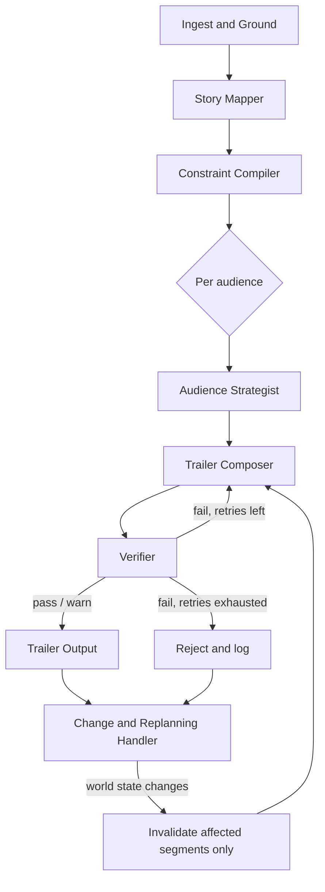

# Movie Trailer Maker — Autonomous Trailer Director

An agentic system that plans **three audience-specific trailers** (family, young adult, dialect-region) from a single episode — evidence-grounded creative planning, independent verification, and selective replanning when contracts, policies, or facts change mid-run — with a lightweight web frontend for submitting source material and reviewing the generated edit decision lists (EDLs).

> Edit decision lists only, no rendered video — see [`backend/KNOWN_LIMITATIONS.md`](backend/KNOWN_LIMITATIONS.md) for the full list of deliberate scope cuts.

## How it works

The backend is a [LangGraph](https://github.com/langchain-ai/langgraph) state machine, not a single freeform agent loop, so generation and verification stay structurally independent:



- **Composer** proposes trailer segments, each carrying a citation back to a real scene/timecode.
- **Verifier** re-derives truth independently against the story map and constraint map — it never grades the Composer's own reasoning, only the cited facts.
- **Change handler** walks a small evidence graph backward from any changed fact (an expired contract, a corrected audience profile) and reruns only the segments that cited it, instead of rebuilding a trailer from scratch.

Full design writeup, the eight verifier checks, and how each of the assignment's "surprise events" is handled → [`backend/ARCHITECTURE.md`](backend/ARCHITECTURE.md).

## Repo layout

```
backend/            Agentic pipeline (LangGraph + FastAPI)
  src/models/         Scene, StoryMap, ConstraintMap, TrailerPlan schemas
  src/ingest/         Episode/contract/policy loading
  src/agents/         StoryMapper, ConstraintCompiler, AudienceStrategist, Composer, Verifier
  src/graph/          LangGraph pipeline wiring
  src/verification/   Deterministic checks (source accuracy, rights, timing, spoilers)
  src/replanning/     Evidence graph + selective replanning
  src/llm/            Model client with fallback + mock/replay
  src/observability/  Decision log
  tests/              Required failure-mode tests
frontend/           Plain HTML/CSS/JS UI — no framework, no build step
  index.html
  css/                style.css, components.css, output.css
  js/                 main.js, inputs.js, category.js, api.js, render-output.js, validate.js
.github/workflows/  CI/CD for both backend and frontend
```

## Backend — setup & run

```bash
cd backend
python -m venv .venv && source .venv/bin/activate
pip install -r requirements.txt
cp .env.example .env   # add ANTHROPIC_API_KEY, or skip and use --mock
```

Run the pipeline from the CLI:

```bash
python -m src.main \
  --episode fixtures/episode_package \
  --contracts fixtures/contracts \
  --policies fixtures/policies \
  --out sample_run/ \
  --mock          # drop this flag once real API keys + episode data are in place
```

Or serve it as an API:

```bash
uvicorn src.api:app --reload
```

Run tests (covers the five required failure modes — missing scene, rights restriction, spoiler, policy failure, changed contract):

```bash
pytest -v
```

Full backend docs → [`backend/README.md`](backend/README.md) · AI usage log → [`backend/AI_COLLABORATION.md`](backend/AI_COLLABORATION.md)

## Frontend — setup & run

No build step, no dependencies — plain HTML/CSS/JS.

```bash
cd frontend
# open index.html directly, or serve the folder with any static server
```

The UI walks through the 8 required inputs (episode video, scene descriptions, dialogue/subtitles, rating policies, contracts, audience profiles, historic performance, cost sheet), lets you pick an audience category, and renders the returned trailer JSON as a playable video placeholder plus a segment-by-segment EDL table with validation status, warnings, and estimated cost. All backend calls live in `js/api.js`.

Full frontend docs → [`frontend/README.md`](frontend/README.md)

## CI/CD

Two workflows under `.github/workflows/`:

- **`backend.yml`** — runs `pytest` on every push/PR touching `backend/`; on a push to `main`, builds and pushes the backend's Docker image to Docker Hub (`theashishdwivedi/movie_trailer_maker`), then deploys to the AWS EC2 instance over SSH.
- **`frontend.yml`** — lints HTML (`htmlhint`), CSS (`stylelint`), and JavaScript (`eslint`) on every push/PR touching `frontend/`; on a push to `main`, copies the static files to the EC2 instance and reloads nginx.

## Tech stack

LangGraph (orchestration) · Anthropic API (LLM calls) · FastAPI (API layer) · Redis (LLM response caching / mock-replay) · pytest (testing) · Docker (packaging) · plain HTML/CSS/JS (frontend) — full rationale in [`backend/ARCHITECTURE.md § 11`](backend/ARCHITECTURE.md).