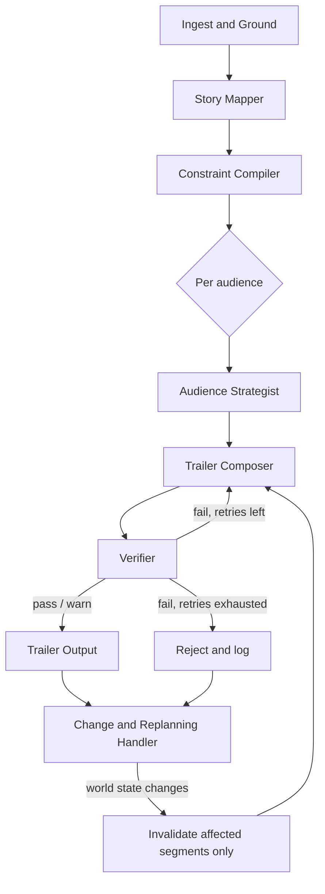

# Architecture — Autonomous Trailer Director

## 1. Design principles

1. **Generation and verification are separate agents that never share trust.** The Composer proposes; it does not get to grade itself. The Verifier re-derives truth from the Story Map and Constraint Map independently and can veto anything, regardless of how well it scores on engagement heuristics.
2. **Evidence-first.** No segment is allowed to exist without a citation back to a real `scene_id` + timecode and the constraint IDs it satisfies. If the Composer can't cite it, the Verifier rejects it on sight — this is what catches hallucinated scenes.
3. **Deterministic checks wherever a check *can* be deterministic.** Timecode existence, contract rights, rating-rule matching, and duration budgets are plain code, not model judgment calls. LLMs are used only for things that genuinely need language/semantic understanding (spoiler-claim extraction, tone, dialect nuance) — and even then, their output is checked against a symbolic rule set, not trusted outright.
4. **Everything except contracts/policy and operator commands is untrusted data.** Episode metadata, scene descriptions, dialogue, subtitles, audience profiles, and historic performance are all treated as content to be *evaluated*, never as instructions. This is what defuses the injected "ignore the contract" scene description — the prompt architecture makes it structurally impossible for that text to be read as a directive.
5. **Fail closed.** An unresolved check blocks a trailer or downgrades it to `PASS_WITH_WARNINGS` with a named human-approval requirement. Nothing is silently waived to make a demo look cleaner.

## 2. Pipeline overview

The system is a LangGraph state machine, not a single freeform agent loop — this keeps the "independent verification" property structural rather than a matter of prompting discipline.

The `D → E1/F1/G1` block runs once per audience (family, young adult, dialect-region), producing three independently verified plans rather than one plan re-labelled three times.

## 3. Component design

### 3.1 Ingest & Grounding Layer
- Parses the episode package, scene descriptions, dialogue, both subtitle tracks, rating policies, contracts, audience profiles, historic performance, and the cost sheet into normalized internal records.
- Builds the **scene registry**: the authoritative list of `scene_id`s and timecode ranges that actually exist in the supplied episode. Anything not in this registry is invalid by construction — this is the direct defense against a model proposing a scene that doesn't exist.
- Ranks source trust: human-authored scene descriptions > AI-generated descriptions > inferred claims. AI-generated tags are cross-checked against the human description or the raw clip before being used as evidence.

### 3.2 Story Mapper
- Produces `story_map.json`: characters, relationships, major events, emotional beats, and a **protected-facts registry** (the specific twists/reveals that count as spoilers).
- Every entry links back to scene registry IDs — nothing goes in the story map that isn't grounded.
- Cross-reads both dialect subtitle tracks against the primary dialogue. A divergence that changes a stated relationship (e.g., subtitle implies "rival" where source says "sibling") is flagged as a `source_conflict` and forces a human decision on which is canonical rather than silently picking one — this is the direct handler for that surprise event.

### 3.3 Constraint Compiler
- Converts rating policies and contracts into a `constraint_map.json` of testable, parameterized rules keyed by scene, actor, audio track, and market/territory (e.g. `actor:X usable_in:[territory list] until:2026-11-01`).
- Contracts and policies are the only inputs from this stage's sources that are ever treated as authoritative — this is the one place "instructions" are allowed to come from data, and it's locked to files loaded at pipeline setup, not anything encountered mid-run in scene text.
- A contract change (e.g., music rights expiring) is a write to this map, which is what the Change Handler watches.

### 3.4 Audience Strategist
- For each audience, states the **audience promise** and intended emotional arc *before* any clip is chosen — this ordering is enforced by the graph (Composer literally cannot run without a promise object as input).
- Reads audience profiles/historic performance as **hypotheses to weigh**, not rules to obey — the prompt explicitly frames historic top-performers as "a claim to verify," which is what lets the Verifier reject a high-performing-but-spoiler-laden scene instead of the Strategist locking onto it.
- Includes a lightweight bias check on its own reasoning: if a personalization choice for the dialect-region audience is justified only by "this is what this region tends to like" with no episode-grounded reason attached, it's flagged before it ever reaches the Composer.

### 3.5 Trailer Composer
- Selects and orders scenes, dialogue, text cards, and music into a segment list matching the required schema, within the duration and cost budget.
- Every segment must carry `evidence` (scene registry IDs, constraint IDs satisfied) and a `reason` tied to the audience promise — no evidence, no segment.

### 3.6 Verifier (independent)
Runs eight checks against the Story Map and Constraint Map, never against the Composer's stated reasoning alone:
1. Source accuracy (timecode/scene exists in registry)
2. Spoiler check (segment set doesn't collectively reveal a protected fact)
3. Story-truth check (claimed relationships/threats exist in the story map, using the canonical subtitle track from 3.2)
4. Rating/policy check per audience
5. Rights check against the constraint map
6. Timing/duration check
7. Accessibility check (subtitle/text presence, not audio-only meaning)
8. Bias/stereotype check (dialect used as evidence-backed personalization, not caricature)

Each check returns pass/fail/warn plus the specific rule or fact it checked against, so a rejection is always explainable.

### 3.7 Repair/Reject Controller
- On failure, sends the Composer the *specific* violated constraint and a bounded number of retries (e.g. 2) with the offending segment removed from the option pool.
- If retries are exhausted, the trailer ships as `FAIL` or `PASS_WITH_WARNINGS` with the unresolved issue documented — never forced through.

### 3.8 Change & Replanning Handler
- Every segment's `evidence` field doubles as an edge in a lightweight **evidence graph**: `segment → scene_id / actor / contract_id / audience_fact`.
- On any world-state change (contract expiry, corrected audience data, a policy update), the handler walks the graph *backward* from the changed fact to find only the segments that cite it, invalidates just those, and re-runs Composer→Verifier for that subset — full trailers are never rebuilt from scratch.
- The decision log records what changed, which segments were affected, and what replaced them.

## 4. Memory model
- **Working memory:** the LangGraph state object — current story map, constraint map, in-progress drafts, verification results — passed node to node, ephemeral per run.
- **Persistent artifacts:** `story_map.json`, `constraint_map.json`, `decision_log.jsonl`, and the three trailer JSONs, written to `sample_run/`. These are the audit trail and also what the Change Handler diffs against.
- **Evidence graph:** not a separate database for a project this size — it's derived on the fly from the `evidence` arrays already present in each segment. Kept as plain JSON/dict; a real production version would put this in Postgres for indexed backward-traversal at scale.

## 5. Multimodal grounding & source accuracy
- All modalities are reduced to one timeline keyed by timecode: video, human scene descriptions, AI scene descriptions, dialogue, and both subtitle tracks.
- The scene registry (3.1) is the single source of truth for "does this exist" — this is what makes source-accuracy checking a lookup rather than a judgment call.
- AI-generated descriptions are advisory evidence only; anything load-bearing for a decision (spoiler status, relationship claims) must also resolve to a human-authored description or the primary dialogue track.

## 6. Why generation and verification stay independent
The Composer and Verifier are separate LangGraph nodes with separate prompts and, critically, the Verifier's input is the Story Map/Constraint Map plus the Composer's *evidence citations* — not the Composer's chain of reasoning or persuasive framing. It re-checks the citation against the registry itself rather than trusting the Composer's claim that a citation is valid. This is what stops a fluent, well-justified, wrong plan from passing: the Verifier doesn't evaluate whether the reasoning sounds good, it evaluates whether the cited facts are actually true.

## 7. Handling the eight surprise events

| Event | Primary handler | Mechanism |
|---|---|---|
| Best-performing scene contains a spoiler | Verifier (spoiler check) | Protected-facts registry check runs regardless of historic performance ranking |
| Audience data has hidden bias | Audience Strategist + Verifier (bias check) | Historic/audience data treated as hypothesis; personalization needs episode-grounded justification |
| Music rights expire mid-run | Constraint Compiler + Change Handler | Contract map update triggers backward graph walk, invalidates only segments citing that track |
| Model proposes a nonexistent scene | Verifier (source accuracy) | Hard reject against the scene registry — not a warning |
| Marketing requests clickbait | Verifier (story-truth check) | Promise/segments must be supported by the story map; unsupported intensity claims fail |
| Subtitle changes a relationship | Story Mapper (source-conflict flag) | Cross-track divergence flagged for human resolution, not silently resolved |
| Prompt injection in a scene description | Ingest layer / prompt framing (3.1, design principle 4) | Scene descriptions are always framed as data in prompts; the model is instructed never to treat embedded text as a directive; contracts are the only authoritative rule source |
| Preferred model becomes unavailable | LLM client wrapper (Section 8) | Fallback model list + circuit breaker; mock/replay mode as ultimate fallback |

## 8. Budget, model fallback, and mock/replay mode
- A budget guard reads the cost sheet at startup and tracks spend through the run; if a trailer would exceed budget, it falls back to a template/rule-based composition pass instead of another LLM call, and this fallback plan is what's reported in `estimated_cost_usd` / `lower_cost_fallback`.
- LLM calls go through a thin client wrapper: primary model → fallback model → cached/replay response, with a simple circuit breaker so one flaky call doesn't stall the whole run.
- Mock/replay mode records every prompt→response pair keyed by an input hash during a real run, then replays them deterministically — this lets the evaluator run the full pipeline without API keys and also *is* the fallback path for the "model unavailable" surprise event.

## 9. Observability
`decision_log.jsonl` — one entry per node execution: `{stage, audience, input_refs, output_refs, verification_result, cost, timestamp, revision_of}`. This gives a full trace from any final segment back to the source material and every check it passed, plus a record of what was revised after a replan and why.

## 10. Human-in-the-loop checkpoints
Any of the following forces `validation.status = PASS_WITH_WARNINGS` or `NEEDS_APPROVAL` rather than auto-shipping: a source-conflict from divergent subtitles, a bias-check flag, a repair loop that exhausted retries, or any rights determination involving ambiguous/partial contract coverage. These are listed explicitly in each trailer's `validation` block, not buried in logs.

## 11. Tech stack & rationale
- **Orchestration:** LangGraph — state machine matches the "independent, inspectable stages" requirement better than a single agent loop.
- **LLM:** Anthropic API for Story Mapper, Audience Strategist, Composer, and the semantic half of the Verifier.
- **Deterministic checks:** plain Python — timecode/registry lookups, contract rule evaluation, duration math. Kept out of the LLM entirely so they're auditable.
- **API layer:** FastAPI, exposing both a CLI entry point and REST endpoints per the "runnable CLI or API" requirement.
- **Storage:** flat JSON files (`story_map.json`, `constraint_map.json`, decision log) — sufficient at this scale and matches the required `sample_run/` layout exactly; Postgres would be the natural upgrade for indexed evidence-graph traversal at production scale, noted here rather than built.
- **Caching:** Redis, used to memoize LLM calls by input hash — this is the same mechanism that powers mock/replay mode.
- **Testing:** pytest, covering the five required failure modes (missing scene, rights restriction, spoiler, policy failure, changed contract).
- **Packaging:** a single Dockerfile for reproducibility — no orchestration beyond that, since the brief explicitly deprioritizes UI/infra polish.

## 12. Deliberate scope cuts for the 10–12 hour budget
- No rendered video output — edit decision lists only, as the brief allows.
- No database — JSON files instead of Postgres/Mongo, since the evidence graph is small enough to traverse in memory for a single-episode run.
- No custom UI — CLI plus the required JSON/markdown artifacts.
- Vision-model cross-checking of raw video frames is stubbed to use the human scene descriptions as ground truth rather than running a separate vision pipeline, given the time budget; this is called out explicitly in `KNOWN_LIMITATIONS.md` as the first thing to add for a real deployment.